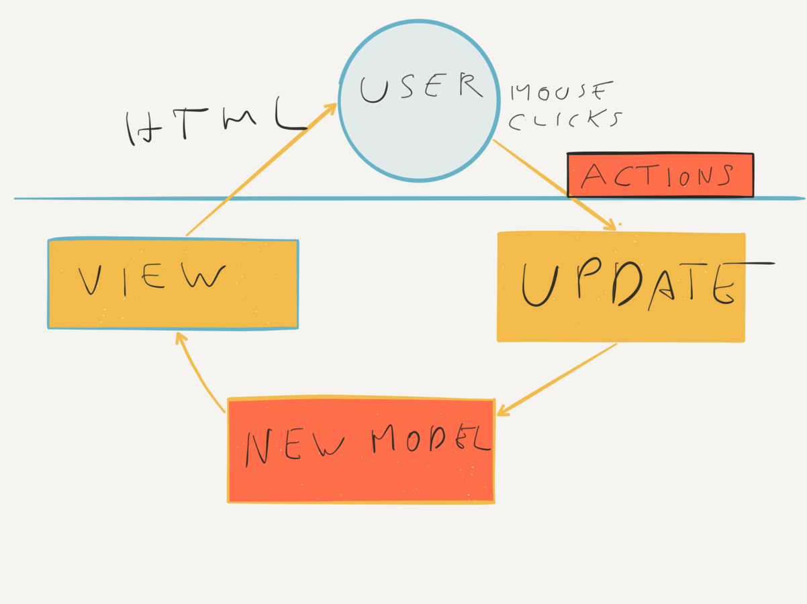

- title : Make Web Apps Fun to Build and Easy to Refactor with Elm
- description : Introduction to React Native with F#
- author : Daniel Bachler
- theme : night
- transition : none
- width: 1920
- height: 1080

***

## Make Web Apps Fun to Build & Easy to Refactor with Elm

<br/>
<br/>

#### Daniel Bachler
#### [danielbachler.de](http://danielbachler.de)
#### [@danyx23](http://twitter.com/danyx23) on Twitter
#### This presentaion: daniebachler.de/elm-at-goto-berlin


***
- data-background-image: images/intro_Ber.png
- data-background-size: contain

***
- data-background-image: images/LandsOfLanguages.jpg
- data-background-size: contain

***

## Elm Elevator pitch

* Purely functional programming language
* Statically typed
* Compiles to JavaScript
* Designed to make Web Apps
* Easy to learn, nice to use


***

## Javascript syntax

```Javascript
function addNumbers(a, b) {
    return a + b;
}

// Whatever
var result = addNumbers(4, "three");
```

---

## Elm syntax

```elm
         addNumbers a  b =
           a + b


-- Compile error!
    result = addNumbers 4  "three"
```

---

## Elm syntax

```elm

addNumbers a b =
    a + b


result = addNumbers 4 3
```


---

## Type annotations

```elm
addNumbers : Int -> Int -> Int
addNumbers a b =
    a + b

result : Int
result = addNumbers 4 3
```

---

## Functions must be a single expression

```elm
calculateFormula : Int -> Int -> Int
calculateFormula a b =
    squaredA = a * a
    squaredB = b * b
    squaredA + squaredB
    -- compile Error
```

---

## Let blocks for intermediate results
### Still: just a single expression!

```elm
calculateFormula : Int -> Int -> Int
calculateFormula a b =
    let
        squaredA = a * a -- <- Compile error
        squaredB = b * b -- <- Compile error
    in
        squaredA + squaredB

```


---

## Records
### (Product types)

```elm
type alias Programmer = 
    { name : String
    , favouriteLanguage : String
    }

daniel : Programmer
daniel = 
    { name = "Daniel"
    , favouriteLanguage = "Elm"
    }

```


---

## All values are immutable

```elm
type alias Programmer = 
    { name : String
    , favouriteLanguage : String
    }

programmerA : Programmer
programmerA = 
    { name = "Daniel"
    , favouriteLanguage = "Elm"
    }

programmerA =
    { name = "Jack"
    , favouriteLanguage = "Java"
    }
-- Compile error!

programmerA.name = "Eve"
-- Compile error!

```


---

## Creating new record values based on old ones

```elm
type alias Programmer = 
    { name : String
    , favouriteLanguage : String
    }

programmerA : Programmer
programmerA = 
    { name = "Daniel"
    , favouriteLanguage = "Elm"
    }

programmerB : Programmer
programmerB = 
    { programmerA 
    | name = "Eve"
    }
```

---

## Union types
### (aka Sum types)

```elm
type Status 
    = Pending
    | Completed

val1 = Pending

type alias Task =
    { name : String
    , status : Status
    }
```

---

## What if only some states have data attached?

* Show progress while task is running
* How would you model this in another language?

---

## Union types
### (aka Sum types)

```elm
type Status 
    = Pending
    | Running Int
    | Completed

val1 : Status
val1 = Running 0
```

---

## Pattern matching

```elm
getUIString : Status -> String
getUIString status =
    match status with
        Pending -> "Not yet started"
        Running 0 -> "Starting"
        Running progress -> "Processing - " ++ (toString progress) ++ "%"
        Completed -> "Completed"
```


---

## Polymorphic types 
### (aka Generics)

```elm
type BinaryTree elementType 
    = Leaf elementType
    | Node (BinaryTree elementType) (BinaryTree elementType)

leafOnly : BinaryTree Int
leafOnly = Leaf 23

smallBinaryTree : BinaryTree Int
smallTree = Node (Leaf 17) leafOnly
```

***

### Creating Web apps with Elm

* Elm comes with a small runtime
* No direkt Javascript FFI

***

### Elm is entirely pure!

* No side effects possible in the language
* (Except Debug.log and Debug.crash)

***

### Command values tell the Elm runtime to perform side effects

* Like HTTP requests
* Random number generation
* ...

***

### The elm architecture

***
- data-background-image: images/Elm.png
- data-background-size: contain

***


### Pain points Elm solves

--- 

### Undefined is not a function
#### Elm doesn't have null/undefined

--- 

### Refactoring is hard & error prone
#### Elm is statically typed and has a simple but powerful type system

--- 

### 
#### Elm is statically typed and has a simple but powerful type system


***

```elm
// MODEL

type alias Model = {
    counters : List Int
}

type Msg = 
| Insert
| Remove
| Modify Int (List Int)

init : Model
init =
    { counters = [] }
```

***

### Modern mobile app development?

* UI/UX
    * "Native mobile apps"
    * Performance
* Tooling
    * Hot loading
    * IntelliSense
* Maintainability
    * Easy to debug
    * Correctness

---

### "Native" UI

 

---
- data-background-image: images/hotloading.gif
- data-background-size: contain

*** 

### Model - View - Update

#### "Elm - Architecture"

 


 <small>http://danielbachler.de/2016/02/11/berlinjs-talk-about-elm.html</small>


*** 

### Thank you!

* https://github.com/fable-compiler/fable-elmish
* https://ionide.io
* https://facebook.github.io/react-native/


***
- data-background-image: images/outro_Ber.png
- data-background-size: contain